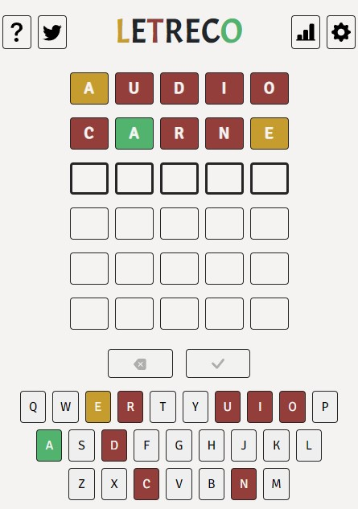
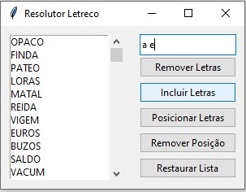
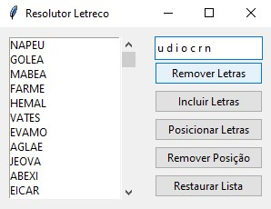
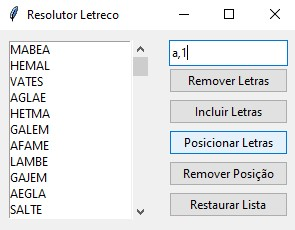
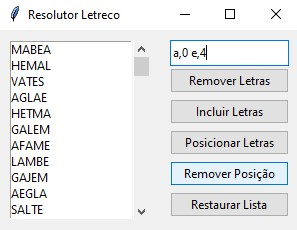

# ResolutorLetreco
A helper for solving the "Letreco" daily puzzle

## INSTALAÇÂO

Baixe o repositório 
```powershell 
git clone https://github.com/srxraposo/ResolutorLetreco
```

Execute o script "app.py"
```py 
python app.py
```

## USO



O script filtra as palavras de acordo com 4 critérios:

 1. Letras que estão na palavra-chave (amarelo ou verde no letreco)
      - Digite as letras que existem na palavra-chave, separando-as por um espaço,  então aperte "Incluir letras"
      - 
 2. Letras que não estão na palavra-chave (vermelho no letreco)
      - Digite as letras que existem na palavra-chave, separando-as por um espaço,  então aperte "Remover letras"
      - 
 3. Letras que estão determinada posição da palavra-chave (verde no letreco)
       - Digite uma dupla letra,posicao [0,4] para cada posicao conhecida da palavra-chave, separando-as por um espaço, então aperte "Posicionar letras"
      - 
 4. Letras que não estão em determinada posição da palavra-chave (amarelo no letreco)
       - Digite uma dupla letra,posicao [0,4] para cada posicao em que uma letra não deve estar na palavra-chave, separando-as por um espaço, então aperte "Posicionar letras"
      - 

Dificilmente restará somente a palavra-chave na lista exibida pelo programa. Cabe a você escolher a palavra que mais faz sentido dentre as opções. 